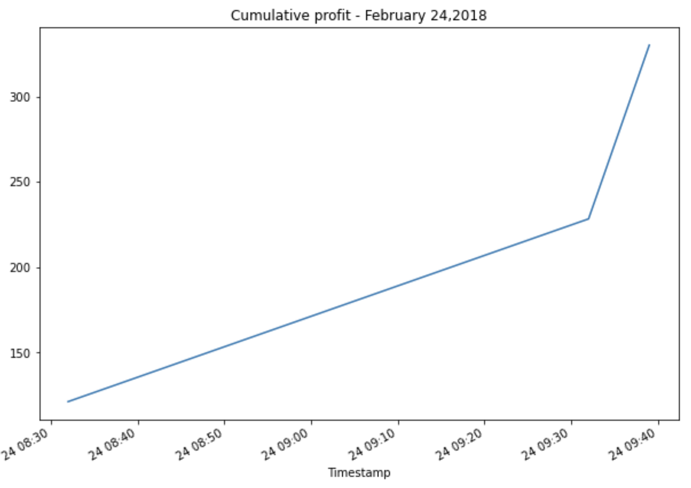

# Crypto-Arbitrage

This is a  python enabled command line interface that represents a finacial analysis on existance of arbitrage opportunities in Bitcoin and other cryptocurrencies from ***January*** 2018 to ***March*** 2018.This includes three phases of financial analysis: 
* Collecting and sorting through historical data for Bitcoin in two exchanges: **Bitstamp** and **Coinbase** from ***January*** 2018 to ***March*** 2018,
* Prepration of datasets by cleaning missing and erroneous data, and 
* Analysis through summary statistics and visualizations in order to determine if any arbitrage opportunities exist for Bitcoin.


---

## Technologies
This project runs on python 3.7 and includes the following libraries and dependencies:

* Pandas
* Pathlib
* Matplotlib inline
* Jupyter Notebook

---

## Installation Guide

To use the application you need to install the following dependencies.

```python
  pip install matplotlib
  pip install pathlib
```
---

## Usage

To use this application just clone the repository and run the **jupyterlab** by running the following command on your terminal:

```jupyterlab```

Upon launching the application  on jupyter lab run the file by clicking on the play button on top of the notebook. 

### Usage Examples





### Arbitrage Analysis Conclusion ###

After analysing the available profit information across each date from the different time period, it can be concluded that on january 16, 2018 very profitable arbitradge opportunity existed with the potential of average profit of 14,147.17 Us dollars for trading in both the exchanges than on February 24,2018 with $330.69 only which might be caused by the technological involvement carried out by the algorithms to trade when arbitrage oppurtunity arise.Eventually,in March 2018 the arbitradge opportunity disappeared because the price of Bitcoin increased due to the increased demand at Bitstamp and the price of Bitcoin decreased at coinbase until the two prices synced.


---

## Contributors

Manisha Lal     
07/04/2022
manisha.lal.2009@gmail.com

---

## License

copyright 2022
